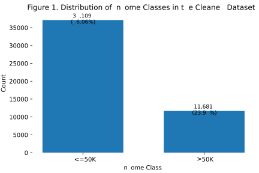
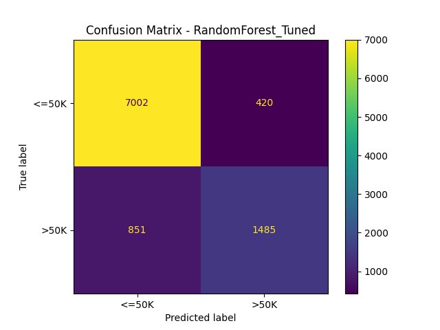

# Adult Income Classification Using Machine Learning

**Course:** CP322 - Machine Learning  
**Instructor:** Dr. Sukhjit Singh Sehra  
**Submitted by:** Touki Zahed and Adnan Awan  
**Date:** March 31, 2026  

---

## Abstract

This project investigates the problem of predicting whether an individual earns more than $50,000 per year using the Adult (Census Income) dataset from the UCI Machine Learning Repository. The task is formulated as a binary classification problem with demographic and employment-related predictors such as age, education, occupation, marital status, capital gain, capital loss, and hours worked per week.

A complete supervised machine learning pipeline was implemented in Python. The workflow included data cleaning, duplicate removal, missing-value handling, feature engineering, train-test splitting, preprocessing with imputation and encoding, model training, evaluation, and hyperparameter tuning. The final system compared a Dummy Classifier, Logistic Regression, Linear Support Vector Machine, Random Forest, and a tuned Random Forest. Feature engineering added `net_capital`, `hours_per_week_group`, and `age_group` to improve representation of the raw tabular data.

The tuned Random Forest achieved the strongest overall performance with a test accuracy of **86.97%** and a ROC-AUC of **0.9222**, exceeding the course requirement that the best selected model achieve at least 80% accuracy. The results also showed that the untuned Random Forest overfit the training data, while hyperparameter tuning improved generalization. Overall, the project demonstrates that careful preprocessing, meaningful feature construction, and model comparison can produce strong predictive performance on structured census-income data.

## 1. Introduction

Machine learning classification methods are widely used in problems where the goal is to assign observations to predefined categories. Income classification is a practical example because it uses demographic, educational, and work-related variables to predict whether a person belongs to a lower- or higher-income group. This kind of task is relevant to socioeconomic analysis, labor-market research, and studies of inequality.

The goal of this project was to classify whether an individual earns more than $50,000 per year using the Adult Income dataset. The project was designed to follow a complete machine learning workflow: data cleaning, preprocessing, feature engineering, model training, hyperparameter tuning, and model evaluation on unseen data. Rather than reporting only one final score, the project emphasizes model comparison, overfitting analysis, and reproducibility.

A second objective was to analyze how preprocessing and model complexity affect performance. Particular attention was given to missing values, class imbalance, skewed variables such as capital gain and capital loss, scaling requirements for linear models, and the gap between training and testing performance.

## 2. Project Description

This project addresses a **binary classification** problem in which the target variable is `income`, with two classes: `<=50K` and `>50K`. The central question is whether machine learning models can accurately predict a person's income category using demographic and employment-related variables.

The project was implemented in Python using a modular structure. Separate classes were used for data loading, preprocessing, feature engineering, model training, evaluation, and visualization, while `src/main.py` orchestrated the full workflow. This organization improves reproducibility and supports the course requirement that the project code be modular and easy to run.

## 3. Data Collection

The dataset used in this project is the **Adult (Census Income)** dataset from the UCI Machine Learning Repository. The raw dataset contained **48,842** observations and **15** columns. After cleaning and duplicate removal, the working dataset contained **48,790** observations and **15** columns.

The target variable is `income`, and the remaining variables serve as predictors. The dataset contains a mix of numerical and categorical features, which makes it well suited to a realistic machine learning pipeline.

### Table 1. Dataset Summary

| Item | Value |
|---|---:|
| Raw observations | 48,842 |
| Cleaned observations | 48,790 |
| Total columns | 15 |
| Predictor columns | 14 |
| Numerical predictors | 6 |
| Categorical predictors | 8 |
| Training instances | 39,032 |
| Testing instances | 9,758 |

The cleaned dataset contained **37,109** observations in the `<=50K` class and **11,681** observations in the `>50K` class, confirming that the target distribution is moderately imbalanced.

## 4. Exploratory Data Analysis

Exploratory data analysis was conducted to understand the structure of the dataset and identify issues that could affect model performance.

First, missing values were present as question marks in several categorical variables, especially `workclass`, `occupation`, and `native_country`. These values were converted to missing values during cleaning so they would not be treated as ordinary categories by downstream models.

Second, the target distribution showed noticeable class imbalance. The majority class was `<=50K`, while the minority class was `>50K`. This mattered because a model could achieve a deceptively high accuracy by simply predicting the majority class. The Dummy Classifier confirmed this concern by reaching about **76.06%** test accuracy while completely failing on the minority class.

The numerical features also showed important patterns. Variables such as `capital_gain` and `capital_loss` were heavily right-skewed, with many observations near zero and a much smaller number of large values. By contrast, variables such as `age` and `hours_per_week` were easier to interpret directly. Because Logistic Regression and Linear SVM are sensitive to feature scale, numerical variables were standardized as part of the preprocessing pipeline.

Feature engineering was used to simplify some relationships in the data. The project added:
- **`net_capital`** = `capital_gain - capital_loss`
- **`hours_per_week_group`** with bins for part-time, full-time, overtime, and extreme-time work
- **`age_group`** with bins for young, adult, middle-aged, and senior observations

These engineered variables were intended to make patterns more interpretable and help the models capture meaningful nonlinear relationships in the original features.

Outlier handling was considered but no rows were removed purely as outliers. Extreme values in income-related variables may reflect real economic behavior rather than data errors, and tree-based models are generally robust to such cases.

## 5. Feature Selection and Preprocessing

Feature selection in this project was conservative. Rather than aggressively dropping variables, the project retained the available predictors after cleaning and relied on preprocessing, engineered features, and model comparison to determine how effectively each model could use the information.

The preprocessing pipeline was implemented with a `ColumnTransformer`:
- Numerical variables were imputed with the **median** and then **standardized**
- Categorical variables were imputed with the **most frequent** category and then **one-hot encoded**
- Unknown categories were ignored during transformation to support robust test-time handling

This approach preserved information from mixed data types while preventing leakage from the test set.

## 6. Methodology

### 6.1 Data Cleaning and Split

The raw CSV file was cleaned by stripping whitespace from string columns, replacing `?` and blank strings with missing values, and dropping duplicate rows. The dataset was then split into features and target.

An **80/20 stratified train-test split** was applied with `random_state=42`. Stratification ensured that the class distribution remained similar in both partitions.

### 6.2 Models

The project compared five classification models:

1. **Dummy Classifier** - baseline model that always predicts the majority class  
2. **Logistic Regression** - interpretable linear classifier for structured tabular data  
3. **Linear SVM** - linear margin-based classifier that often performs well after one-hot encoding  
4. **Random Forest** - nonlinear ensemble of decision trees  
5. **Tuned Random Forest** - Random Forest optimized using grid search and cross-validation  

### 6.3 Hyperparameter Tuning

Hyperparameter tuning was performed for Random Forest using `GridSearchCV` with **3-fold cross-validation** and accuracy as the optimization metric. The search space included:

- `n_estimators`: 100, 200  
- `max_depth`: None, 10, 20  
- `min_samples_split`: 2, 5  
- `min_samples_leaf`: 1, 2  

The best parameter combination was:

- `n_estimators = 200`
- `max_depth = None`
- `min_samples_split = 2`
- `min_samples_leaf = 2`

### 6.4 Evaluation Metrics

Models were evaluated on the held-out test set using:

- Accuracy
- Weighted Precision
- Weighted Recall
- Weighted F1-score
- ROC-AUC
- Confusion Matrix
- Class-specific precision, recall, and F1-scores from the saved classification reports

Accuracy was the course headline metric because the selected best model had to exceed 80%, but additional metrics were necessary because the classes were imbalanced.

## 7. Results and Experimental Analysis

### Table 2. Model Performance on the Test Set

| Model | Train Accuracy | Test Accuracy | Weighted Precision | Weighted Recall | Weighted F1 | ROC-AUC |
|---|---:|---:|---:|---:|---:|---:|
| DummyClassifier | 0.7606 | 0.7606 | 0.5785 | 0.7606 | 0.6572 | 0.5000 |
| LogisticRegression | 0.8527 | 0.8556 | 0.8498 | 0.8556 | 0.8510 | 0.9098 |
| LinearSVM | 0.8528 | 0.8565 | 0.8505 | 0.8565 | 0.8514 | 0.9094 |
| RandomForest | 0.9999 | 0.8570 | 0.8522 | 0.8570 | 0.8536 | 0.9082 |
| RandomForest_Tuned | 0.9034 | 0.8697 | 0.8648 | 0.8697 | 0.8650 | 0.9222 |

The baseline Dummy Classifier achieved **76.06%** accuracy by always predicting the majority class. This result confirms that the dataset is imbalanced and that a useful model must outperform the baseline by a meaningful margin.

Both **Logistic Regression** and **Linear SVM** performed strongly, with test accuracies above **85.5%** and ROC-AUC values around **0.91**. These results show that the preprocessing pipeline and engineered features made the tabular data suitable even for linear classifiers.

The untuned **Random Forest** slightly outperformed the linear models on test accuracy, but its training accuracy reached **99.99%**, which is a clear sign of overfitting. The model fit the training data almost perfectly but did not generalize as well as expected on unseen data.

After hyperparameter tuning, the **Tuned Random Forest** achieved the best overall balance between fit and generalization. Its training accuracy decreased to **90.34%**, while its test accuracy improved to **86.97%**. It also achieved the highest weighted F1-score and the highest ROC-AUC.

### 7.1 Minority-Class Performance

Because the `>50K` class is the minority class, class-specific metrics matter.

From the saved classification reports:
- **Logistic Regression** achieved precision **0.74**, recall **0.62**, and F1-score **0.67** on the `>50K` class
- **Linear SVM** achieved precision **0.74**, recall **0.61**, and F1-score **0.67**
- **Random Forest** achieved precision **0.73**, recall **0.64**, and F1-score **0.68**
- **Tuned Random Forest** achieved precision **0.78**, recall **0.64**, and F1-score **0.70**

These results show that the tuned Random Forest was not only the most accurate overall model, but also the strongest model for the minority class.

### 7.2 Best Model Analysis

The selected final model was the **Tuned Random Forest**. It achieved the highest test accuracy, the highest ROC-AUC, and the strongest balance across the weighted metrics. Most importantly, it exceeded the assignment requirement that the best model achieve at least 80% accuracy.

The tuned Random Forest was effective for several reasons:
- it captures nonlinear relationships and interactions across mixed demographic and economic variables
- it is robust to skewed numerical variables
- it benefits from ensemble averaging, which reduces variance relative to a single decision tree

The confusion matrix below visually confirms strong performance on the majority class while still improving recognition of the minority class.

### 7.3 Overfitting, Generalization, and Limitations

One of the most important findings in the project was the contrast between the untuned and tuned Random Forest models. The untuned model nearly memorized the training data, which is visible in the extreme train-test gap. After tuning, the training accuracy dropped and the testing performance improved, showing better generalization.

The linear models also remained competitive. This is meaningful because they are simpler, faster, and more interpretable. In some real-world settings, a slightly less accurate but more interpretable model such as Logistic Regression might still be preferred. For this project, however, predictive performance was the primary selection criterion.

The project also has limitations. First, no advanced feature selection method was applied beyond preprocessing and engineered features. Second, the dataset reflects a specific historical and demographic context, so the results should not be interpreted as universally transferable. Third, stronger ensemble methods such as Gradient Boosting or XGBoost were not tested and could be explored in future work.

## 8. Conclusion

This project successfully applied machine learning methods to the Adult Income classification problem. Starting from a raw tabular dataset with numerical and categorical variables, the project built a complete workflow that included cleaning, missing-value handling, feature engineering, preprocessing, model comparison, evaluation, and hyperparameter tuning.

Among the evaluated models, the **Tuned Random Forest** achieved the strongest overall performance with **86.97%** test accuracy and **0.9222** ROC-AUC. This exceeded the course requirement and demonstrated that careful tuning improved generalization relative to the untuned Random Forest.

The project also reinforced several key machine learning lessons:
- baselines are necessary for meaningful comparison
- preprocessing and feature representation strongly affect model quality
- overfitting must be analyzed with both training and testing results
- class-specific metrics matter when the data are imbalanced

Future improvements could include testing additional ensemble methods, performing threshold optimization for the minority class, and adding interpretability analysis for the best-performing model.

## References

Becker, B., & Kohavi, R. (1996). *Adult* [Data set]. UCI Machine Learning Repository.  
Breiman, L. (2001). Random forests. *Machine Learning, 45*(1), 5-32.  
Cortes, C., & Vapnik, V. (1995). Support-vector networks. *Machine Learning, 20*(3), 273-297.  
Harris, C. R., Millman, K. J., van der Walt, S. J., Gommers, R., Virtanen, P., Cournapeau, D., et al. (2020). Array programming with NumPy. *Nature, 585*, 357-362.  
McKinney, W. (2010). Data structures for statistical computing in Python. In *Proceedings of the 9th Python in Science Conference* (pp. 56-61).  
Pedregosa, F., Varoquaux, G., Gramfort, A., Michel, V., Thirion, B., Grisel, O., et al. (2011). Scikit-learn: Machine learning in Python. *Journal of Machine Learning Research, 12*, 2825-2830.
